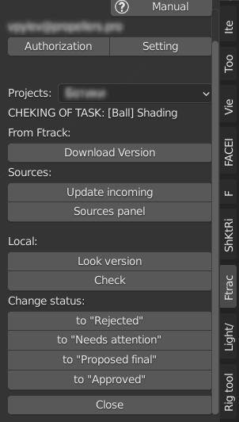
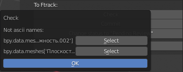

.. _check-panel-page:

Checking Panel
==============

Панель отображаемая когда файл активной задачи ткрыт для проверки в :ref:`tasks_list_role` ``Cheking``.

.. _check_panel_ftrack:

From Ftrack:
------------

Группа кнопок для взаимодействия с ftrack.

.. _check_panel_download_version:

Download version
~~~~~~~~~~~~~~~~

:guilabel:`Download version` - Загрузка версии активной задачи с ftrack на локальный компьютер пользователя.

Sources:
--------

.. _check_panel_update_incoming:

Update incoming
~~~~~~~~~~~~~~~

:guilabel:`Update incoming` - Загрузка с *ftrack* недостающих входящих компонентов для активной задачи, полностью аналогична :ref:`selected_panel_update_incoming`

.. _check_panel_sources_panel:

Sources panel
~~~~~~~~~~~~~

:guilabel:`Sources panel` - Открытие панели с перечнем исходников активной задачи, с возможностью загрузки ``collections`` по выбору из исходников в текущий рабочий файл.

.. _check_panel_local:

Local:
------

Группа кнопок взаимодействия с локальными весриями активной задачи.

.. _check_panel_open_version:

Look version
~~~~~~~~~~~~

:guilabel:`Look version` - Открытие (без смены статуса) локальной версии активной задачи по выбору.

.. attention:: **top** версия файла будет перезаписана.

.. _check_panel_check:

Check
~~~~~

:guilabel:`Check` - Проверка текущей сцены на соответствие с требованиями для данного типа задачи.

* При обнаружении несоответствий, будет запущено информационное окно.

.. _check_panel_notes:

Notes:
------

`(видео) <https://disk.yandex.ru/i/yRKNPQEyOGHjIw>`_

.. _check_panel_open_last_commit_by_web:

Open last Commit by web
~~~~~~~~~~~~~~~~~~~~~~~

:guilabel:`Open last Commit by web` - Открывает обзор последней версии коммита ассета в вёб браузере.

.. _check_panel_open_last_review_by_web:

Open last Review by web
~~~~~~~~~~~~~~~~~~~~~~~

:guilabel:`Open last Review by web` - Открывает обзор последней версии ревью ассета в вёб браузере.

.. _check_panel_change_status:

Change status:
--------------

Кнопки меняющие статус данной задачи по результатам проверки.

.. _check_panel_status_to_rejected:

to "Rejected"
~~~~~~~~~~~~~

:guilabel:`to "Rejected"` - Отказано или на переработку.

.. _check_panel_status_to_needs_attention:

to "Needs attention"
~~~~~~~~~~~~~~~~~~~~

:guilabel:`to "Needs attention"` - Требует внимания или дальнейшего рассмотрения.

.. _check_panel_status_to_proposed_final:

to "Proposed final"
~~~~~~~~~~~~~~~~~~~

:guilabel:`to "Proposed final"` - Предложено как временный финал, но в дальнейшем будет доработано.

.. _check_panel_status_to_approved:

to "Approved"
~~~~~~~~~~~~~

:guilabel:`to "Approved"` - Принято.