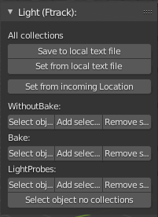

.. _lcm-page:

Light(Ftrack)
=============

Самостоятельная панель с инструментами для экспорта-импорта настроек освещения **eevee**.

`Применение настроек в шот (видео) <https://disk.yandex.ru/d/uEfA4NYCT3CUxQ>`_

Save to local text file
-----------------------

:guilabel:`Save to local text file` - сохранение настроек в текстовый файл в директорию ``meta`` задачи.

* Предполагается выполнение в задаче Локации.

Set from local text file
-------------------------

:guilabel:`Set from local text file` - применение локально сохранённых настроек и создание иерархий (из текстового файла, из директории ``meta`` задачи).

Set from incoming Location
--------------------------

:guilabel:`Set from incoming Location` - применение настроек и создание иерархий из текстового файла входящей задачи локации.

* Предполагается применение в задаче шота.
* Задача локации должна быть назначена во входящих связях шота и подгружена через :ref:`work_panel_update_incoming`.

Управление служебными коллекциями
---------------------------------

WithoutBake
~~~~~~~~~~~

:guilabel:`Select objects` - выделить объекты коллекции *WithoutBake*.

:guilabel:`Add selectted objects` - добавить выделенные объекты в коллекцию *WithoutBake* (при отсутствии создать коллекцию).

:guilabel:`Remove selected objects` - удалить выделенные объекты из коллекции *WithoutBake*.

Bake
~~~~

:guilabel:`Select objects` - выделить объекты коллекции *Bake*.

:guilabel:`Add selectted objects` - добавить выделенные объекты в коллекцию *Bake* (при отсутствии создать коллекцию).

:guilabel:`Remove selected objects` - удалить выделенные объекты из коллекции *Bake*.

LightProbes
~~~~~~~~~~~

:guilabel:`Select objects` - выделить объекты коллекции *LightProbes*.

:guilabel:`Add selectted objects` - добавить выделенные объекты в коллекцию *LightProbes* (при отсутствии создать коллекцию).

:guilabel:`Remove selected objects` - удалить выделенные объекты из коллекции *LightProbes*.

Select objects no collections
-----------------------------

:guilabel:`Select objects no collections` - выделяет объекты не входящие ни в одну из вышеперечисленных коллекций.