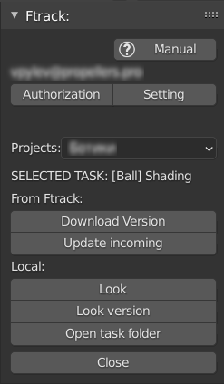

.. _check-selected-panel-page:

Selected Panel (Checking)
=========================

Панель отображаемая при выборе задачи из списка, до взятия в работу в роли проверяющего.

.. _check_selected_panel_ftrack:

From Ftrack:
------------

.. _check_selected_panel_download_version:

Download version
~~~~~~~~~~~~~~~~

:guilabel:`Download version` - Загрузка версии активной задачи с ftrack на локальный компьютер пользователя.

.. _check_selected_panel_update_incoming:

Update incoming
~~~~~~~~~~~~~~~

:guilabel:`Update incoming` - Загрузка с ftrack недостающих входящих компонентов для активной задачи.

.. _check_selected_panel_local:

Local:
------

.. _check_selected_panel_look:

Look
~~~~

:guilabel:`Look` - Открытие (без смены статуса) **top** версии активной задачи.

* Будет открыта :ref:`check-panel-page`

.. _check_selected_panel_look_version:

Look version
~~~~~~~~~~~~

:guilabel:`Look version` - Открытие (без смены статуса) локальной версии активной задачи по выбору.

* Будет открыта :ref:`check-panel-page`

.. _check_selected_panel_open_task_folder:

Open task folder
~~~~~~~~~~~~~~~~

:guilabel:`Open task folder` - Запуск проводника в папке данной задачи.