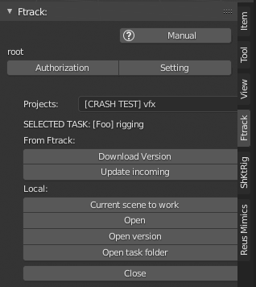

.. _work-selected-panel-page:

Selected Panel (work)
=====================

Панель отображаемая при выборе задачи из списка, до взятия в работу.

`Selected panel (видео) <https://youtu.be/Iav8T8ZGc5A>`_

.. _selected_panel_ftrack:

From Ftrack:
------------

Группа кнопок для взаимодействия с ftrack.

.. _selected_panel_download_version:

Download version
~~~~~~~~~~~~~~~~

:guilabel:`Download version`

Загрузка версии активной задачи с ftrack на локальный компьютер пользователя.

.. _selected_panel_update_incoming:

Update incoming
~~~~~~~~~~~~~~~

:guilabel:`Update incoming`

Загрузка с ftrack недостающих входящих компонентов для активной задачи.

.. _selected_panel_local:

Local:
------

*	Группа кнопок взаимодействия с локальными весриями активной задачи.
*	Все кнопки предполагают какое-либо открытие рабочего файла и взятие его в работу.
*	Во все случаях:

	*	открыта будет **top** версия рабочего файла.
	*	статус задачи будет изменён на ``In progress``, при наличии другой задачи в таком статусе, она будет поставлена на паузу.
	*	будет открыта :ref:`work-panel-page`

.. _selected_panel_current_scene_to_work:

Current scene to work
~~~~~~~~~~~~~~~~~~~~~

:guilabel:`Current scene to work`

* Взятие в работу текущей открытой сцены, с копированием в **top** версию активной задачи.
	* Если данный файл уже является **top** версией данной задачи, то копирования файла производиться не будет.
* Будет открыта :ref:`work-panel-page`

.. attention:: **top** версия рабочего файла будет перезаписана, если не был сделан :ref:`work_panel_commit` данные не сохранятся.

.. _selected_panel_open:

Open
~~~~

:guilabel:`Open`

* Открытие **top** версии активной задачи.
* Будет открыта :ref:`work-panel-page`

.. _selected_panel_open_version:

Open version
~~~~~~~~~~~~

:guilabel:`Open version`

* Открытие локальной версии активной задачи по выбору.
* Будет открыта :ref:`work-panel-page`

.. attention:: **top** версия рабочего файла будет перезаписана, если не был сделан :ref:`work_panel_commit` данные не сохранятся.

.. _selected_panel_open_task_folder:

Open task folder
~~~~~~~~~~~~~~~~

:guilabel:`Open task folder`

Запуск проводника в папке данной задачи.