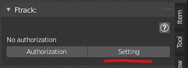
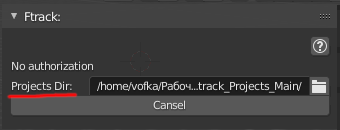

.. _manual-settings-page:

Настройки
=========

* Панель настроек запускается кнопкой :guilabel:`Setting` в панели аддона.

.. _projects_folder_settings:

Директория для проектов
-----------------------

Все рабочие файлы и мета данные аддон будет искать в директории, определённой в настройках **Projects Dir**

* При этом название самой директории **Ftrack_Projects_Main** она будет создана в указанной директории.

* Если выбрать саму директорию **Ftrack_Projects_Main** то ничего создаваться не будет и эта директория станет рабочей.

.. note:: Можно иметь любое количество таких директорий для разных проектов и переключаться между ними.

Выбор графических редакторов
----------------------------

Добавление графических редакторов в список, для дальнейшего использования их при редактировании текстур :ref:`work_panel_edit_textures`.