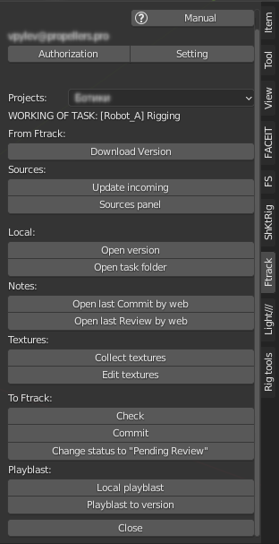
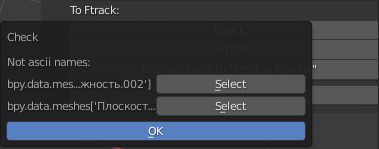

.. _work-panel-page:

Working Panel
=============

Панель отображаемая когда файл активной задачи находится в работе.

`Work panel (видео) <https://youtu.be/43lPkwNfywU>`_

.. _work_panel_ftrack:

From Ftrack:
------------

Группа кнопок получения данных с *ftrack* полностью аналогична :ref:`selected_panel_ftrack`

.. _work_panel_download_version:

Download version
~~~~~~~~~~~~~~~~

:guilabel:`Download version` - Загрузка версии активной задачи с *ftrack* на локальный компьютер пользователя, полностью аналогична :ref:`selected_panel_download_version`

.. _work_panel_sources:

Sources:
--------

.. _work_panel_update_incoming:

Update incoming
~~~~~~~~~~~~~~~

:guilabel:`Update incoming` - Загрузка с *ftrack* недостающих входящих компонентов для активной задачи, полностью аналогична :ref:`selected_panel_update_incoming`

.. _work_panel_sources_panel:

Sources panel
~~~~~~~~~~~~~

:guilabel:`Sources panel` - Открытие панели с перечнем исходников активной задачи, с возможностью загрузки ``collections`` по выбору из исходников в текущий рабочий файл.

.. _work_panel_local:

Local:
------

Группа кнопок взаимодействия с локальными весриями активной задачи.

.. _work_panel_open_version:

Open version
~~~~~~~~~~~~

:guilabel:`Open version` - Открытие локальной версии активной задачи по выбору.

.. attention:: **top** версия рабочего файла будет перезаписана, если не был сделан :ref:`work_panel_commit` данные не сохранятся.

.. _work_panel_open_task_folder:

Open task folder
~~~~~~~~~~~~~~~~

:guilabel:`Open task folder` - Запуск проводника в папке данной задачи.

.. _work_panel_textures:

.. _work_panel_notes:

Notes:
------

`(видео) <https://disk.yandex.ru/i/yRKNPQEyOGHjIw>`_

.. _work_panel_open_last_commit_by_web:

Open last Commit by web
~~~~~~~~~~~~~~~~~~~~~~~

:guilabel:`Open last Commit by web` - Открывает обзор последней версии коммита ассета в вёб браузере.

.. _work_panel_open_last_review_by_web:

Open last Review by web
~~~~~~~~~~~~~~~~~~~~~~~

:guilabel:`Open last Review by web` - Открывает обзор последней версии ревью ассета в вёб браузере.

Textures:
---------

.. _work_panel_collect_textures:

Collect textures
~~~~~~~~~~~~~~~~

:guilabel:`Collect textures` - Сборка текстур с перезаписью путей, в директорию **textures** активной задачи. 

`Collect textures (видео) <https://youtu.be/iTCtTxtwsns>`_

.. note:: Собираются только текстуры находящиеся за пределами :ref:`projects_folder_settings`.

.. _work_panel_edit_textures:

Edit textures
~~~~~~~~~~~~~

:guilabel:`Edit textures` - Открытие графического редактора для редактирования текстур из директории **textures** активной задачи.

`Edit textures (видео) <https://youtu.be/pwS9yW_cA9s>`_

Специфичные для типов задач панели:
-----------------------------------

.. toctree::
   :maxdepth: 1

   work_panel/animation_tools
   work_panel/animatic_tools

.. _work_panel_to_ftrack:

To Ftrack:
----------

.. _work_panel_check:

Check
~~~~~

:guilabel:`Check` - Проверка текущей сцены на соответствие с требованиями для данного типа задачи.

* При обнаружении несоответствий, будет запущено информационное окно.

.. _work_panel_commit:

Commit
~~~~~~

:guilabel:`Commit` - Фиксация изменений **top** версии, создание новой локальной версии, запуск фоновой загрузки версии на *ftrack*.

* Если поставить галочку ``To Review`` то статус задачи изменится на *Pending Review* и создаваемая версия также будет в этом статусе.

.. image:: ../_static/images/commit_to_review.png

.. _work_panel_change_status_to_pending_review:

Change status to "Pending Review"
~~~~~~~~~~~~~~~~~~~~~~~~~~~~~~~~~

:guilabel:`Change status to "Pending Review"` - Изменение статуса на *Pending Review* без создания версии.

.. _work_panel_playblast:

Playblast:
----------

Создание и отправка версий плейбластов на *ftrack* с настройками проекта и шота.

.. image:: ../_static/images/working_panel_playblast.png

.. _work_panel_playblast_local_playblast:

Local playblast
~~~~~~~~~~~~~~~

:guilabel:`Local playblast` - Создание плейбласта без отправки версии, но с сохранением по настройкам.

Playblast to version
~~~~~~~~~~~~~~~~~~~~

:guilabel:`Playblast to version` - Создание версии с плейбластом.

.. image:: ../_static/images/playblast_to_version.png

Параметры всплывающего диалога:

* **Status to "Pending review"** - назначение статуса версии, по умолчанию ``True``, если снять галочку то статус версии будет "In progress".

* **Use latest playblast** - создаст версию с последним сохранённым плейбластом созданным в :ref:`work_panel_playblast_local_playblast`.

* **Description** - обязательное для заполнения поле с кратким комментарием для данной версии.

* **Make commit** - если ``True`` то будет так же сделан и :ref:`work_panel_commit`, по умолчанию ``True``.