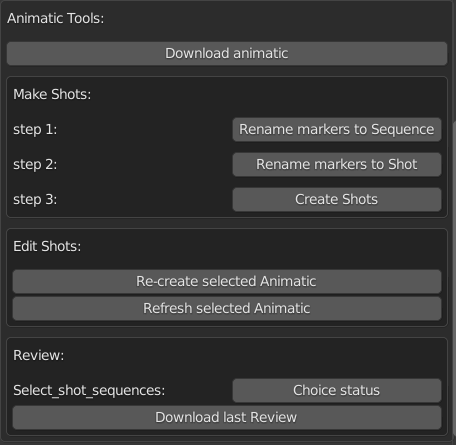

.. _animatic-tools-page:

Animatic tools
==============

Функционал для работы над аниматиком и фильмом в целом в задачах эпизода.

.. _animatic_tools_download_animatic:

Download_animatic
-----------------

:guilabel:`Download_animatic` - Загрузка в секвенсор видео аниматика на первые две дорожки.

* Поиск файла для загрузки локальный.
    * Допустимый формат **mp4**.
* Будет произведена очистка первой и второй дорожки перед загрузкой.
* Выбранный файл будет переименован **Animatic_<episode_name>.mp4** и загружен в директорию данной задачи.
    * данный файл не будет упаковываться в версию при коммите.
* Временной диапазон сцены будет выставлен автоматически по диапазону видео файла.
* Удовлетворение *fps* аниматика проекту на совести пользователя.

.. _animatic_tools_make_shots:

Make shots:
-----------

Разрезка аниматика на шоты, с созданием ассетов данных шотов в *ftrack* (при отсутствии) и создание версий с видео аниматика в задачи данных шотов.

.. note:: Следующие три шага выполняются последовательно один раз.

.. _animatic_tools_step1:

Step1
~~~~~

Разметка границ секвенций

* границы отмечаются маркерами
* именовать маркеры не обязательно
* первый и последний кадры аниматика отмечать не нужно.

Rename markers to Sequence
**************************

:guilabel:`Rename markers to Sequence` - По клику по данной кнопке маркеры будут переименованы в актуальные для данного эпизода имена секвенций.

* Если маркеров небыло вообще, то будет создан один маркер в первом кадре.

.. _animatic_tools_step2:

Step2
~~~~~

Разметка границ шотов

* границы отмечаются маркерами
* именовать маркеры не обязательно

.. _animatic_tools_rename_markers_to_shot:

Rename markers to Shot
**********************

:guilabel:`Rename markers to Shot` - По клику по данной кнопке маркеры будут переименованы в актуальные для данного эпизода и секвенций имена шотов.

* Наличие хотя бы одного маркера секвенции обязательно.
* Маркеры секвенций так же будут перименованы в имена шотов.

.. _animatic_tools_step3:

Step3
~~~~~

Создание шотов по маркерам

.. note:: Перед этим шагом, надо выполнить до конца разметку шотов и убедится в корректности.

* Проверяется наличие ассета для данного шота, при отсутствии шот создаётся
    * создаваемые шоты размещаются в папке *Shots* на одном уровне с ассетом эпизода в *ftrack*.
        * *Shots* при отсутствии создаётся.
* Для шотов заполняются параметры тайминга.
* Создаётся плейбласт который публикуется в соответствующую версию в задачи шотов.
* На каждый шот в секвенсоре создаются мувки.

.. _animatic_tools_create_shots_button:

Create Shots
************

:guilabel:`Create Shots` - Клик по данной кнопке откроет диалог где надо указывать количество создаваемых шотов и выбрать шаблон для создаваемых ассетов.

    * Создание шотов длительный процесс, и может случится разное, поэтому рекомендуется создавать небольшими пакетами, число по умолчанию 10. После каждого цикла делать обязательный сейв.
    * Число создаваемых шотов можно указать любое, но будет использовано ближайшее чётное, для правильного чередования мувиков на дорожках в секвенсоре.

.. _animatic_tools_edit_shots:

Edit Shots:
-----------

Всевозможные манипуляции с секвенциями аниматиков шотов.

.. _animatic_tools_re_create_selected_animatic:

Re-create selected Animatic
~~~~~~~~~~~~~~~~~~~~~~~~~~~

:guilabel:`Re-create selected Animatic` - Пересоздание видеодорожек аниматика шотов, в случае изменений самого аниматика серии.

* Работает с выбранными в секвенсоре дорожками.
* Предварительно следует загрузить новый аниматик серии :ref:`animatic_tools_download_animatic`
* Клик по данной кнопке, откроет диалог где надо согласиться для продолжения, после чего для выбранных в секвенсоре шотов будет произведено пересоздание аниматиков.
    * Данные старта, финиша и длительности будут браться непосредственно из выбранных дорожек.
    * Не имеет значения что выбирать звуковую дорожку или *мувку*, если выбрать и то, и то - всё равно отработает корректно.
    * Выбор самого аниматика будет проигнорирован.

.. attention:: Создание шотов длительный процесс, и может случится разное, поэтому рекомендуется создавать небольшими пакетами.

.. _animatic_tools_refresh_selected_shots:

Refresh selected Animatic
~~~~~~~~~~~~~~~~~~~~~~~~~

:guilabel:`Refresh selected Animatic` - обновление видеофайла аниматика на последнюю версию из *ftrack*. Для случаев когда нарезка делалась на другом компьютере, сами нарезанные *мувки* аниматиков не пакуются в версию эпизода и секвенции шотов в этом случае могут быть или пустышками, или содержать устаревшие *мувки*.

* Работает с выбранными в секвенсоре дорожками.
* Не имеет значения что выбирать звуковую дорожку или *мувку*, если выбрать и то, и то - всё равно отработает корректно, даже если выбранная секвенция пустышка.
* Клик по данной кнопке, откроет диалог где надо согласиться для продолжения.

.. _animatic_tools_review:

Review:
-------

Всевозможные действия связанные со сбором в секвенсор ревью шотов от аниматоров.

.. _animatic_tools_select_shot_sequences:

Select shot sequences:
~~~~~~~~~~~~~~~~~~~~~~

Выбор секвенций шотов по статусам их задач. Например для загрузки ревью, находящихся в статусе на проверку.

`(видео) <https://disk.yandex.ru/i/pKNW9LgOhNhUgw>`_

:guilabel:`Сhoice status` - Эта кнопка откроет далог для выбора статуса, дальнейший клик по :guilabel:`Ok` выберет все секвенции шотов, задачи которых соттветствуют выбранному статусу.

.. note:: Процедура занимает некоторое время, но результат кешируется, и в следующие 3 минуты выбор по различным статусам будет без задержек.

.. _animatic_tools_download_last_review:

Download last Review
~~~~~~~~~~~~~~~~~~~~

:guilabel:`Download last Review` - Зарузка в секвенсор последней версии превью шота от аниматоров.

* Загружает ревью для выбранных в секвенсоре дорожкам шотов или ревью.
* Обновляет существующие ревью.
* Не имеет значения что выбирать звуковую дорожку или *мувку*, если выбрать и то, и то - всё равно отработает корректно, даже если выбранная секвенция пустышка.
* Клик по данной кнопке, откроет диалог где надо согласиться для продолжения.
* Секвенции ревью создаются на 8 и 10 дорожках секвенсора.

.. image:: ../../_static/images/sequence_editor_channels.png

.. _animatic_tools_timing_from_selected_sequences:

Timing from selected shots
--------------------------

:guilabel:`Timing from selected shots` - установит временные рамки сцены в пределах выделенных секвенций в *Sequence Editor*.

.. _animatic_tools_checking_shot:

Checking shot:
--------------

`(видео) <https://disk.yandex.ru/i/7RIwxp8Z9Z2uYw>`_

Инструменты для принимающего анимационные шоты: переписка по шотам и смена статуса. Содержимое заполняется для выделенного шота.

.. _animatic_tools_open_last_review_by_web:

Open last Review by web
~~~~~~~~~~~~~~~~~~~~~~~

:guilabel:`Open last Review by web` - Открывает обзор последней версии ревью выделенного шота в вёб браузере.

.. _animatic_tools_change_status:

Change status:
~~~~~~~~~~~~~~

Кнопки меняющие статус как последнего ревью так и задачи выделенного шота.

.. _animatic_tools_status_to_rejected:

to "Rejected"
*************

:guilabel:`to "Rejected"` - Отказано или на переработку.

.. _animatic_tools_status_to_needs_attention:

to "Needs attention"
********************

:guilabel:`to "Needs attention"` - Требует внимания или дальнейшего рассмотрения.

.. _animatic_tools_status_to_proposed_final:

to "Proposed final"
*******************

:guilabel:`to "Proposed final"` - Предложено как временный финал, но в дальнейшем будет доработано.

.. _animatic_tools_status_to_approved:

to "Approved"
*************

:guilabel:`to "Approved"` - Принято.