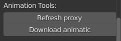

.. _animation-tools-page:

Animation tools
===============

Функционал для работы с анимацией.

.. _animation_tools_refresh_proxy:

Refresh proxy
~~~~~~~~~~~~~

:guilabel:`Refresh proxy` - Пересоздаёт выделенный прокси с сохранением положения и анимационного экшена.

`Refresh proxy (видео) <https://youtu.be/zato5UMp3Yg>`_

* Копирует ``child_off`` констрейн на **root** контрол и на сам прокси объект(если есть).
* При наличаи ``child_off`` констрейна:
    * функцию лучше всего производить в первом кадре, до начала анимации,
    * после выполнения функции сделать ``Set Inverse`` в самом констрейне.

.. _animation_tools_download_animatic:

Download animatic
~~~~~~~~~~~~~~~~~

:guilabel:`Download animatic` - Загружает из *ftrack* последнюю версию видеофайла аниматика в директорию задачи.

* Создаёт секвенции с мувкой и звуком на 1-ой и 2-ой дорожках секвенсора.
* Выставляет временной диапазон сцены:
    * старт из параметра ``Frame Start`` проекта, а финиш по длительности.
* Отображает аниматик на фоне камеры шота в верхнем правом углу, с прозрачностью 0,5.

    .. image:: ../../_static/images/animatic_bg_images.png

