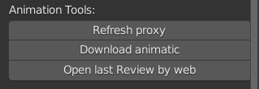

.. _animation-tools-page:

Animation tools
===============

Функционал для работы с анимацией.

.. _animation_tools_refresh_proxy:

Refresh proxy
~~~~~~~~~~~~~

:guilabel:`Refresh proxy`

`Refresh proxy (видео) <https://youtu.be/zato5UMp3Yg>`_

* Пересоздаёт выделенный прокси с сохранением положения и анимационного экшена.
* Копирует ``child_off`` констрейн на **root** контрол и на сам прокси объект(если есть).
* При наличаи ``child_off`` констрейна:
    * функцию лучше всего производить в первом кадре, до начала анимации,
    * после выполнения функции сделать ``Set Inverse`` в самом констрейне.

.. _animation_tools_download_animatic:

Download animatic
~~~~~~~~~~~~~~~~~

:guilabel:`Download animatic`

* Загружает в директорию задачи последнюю версию видеофайла аниматика.
* Создаёт секвенции с мувкой и звуком на 1-ой и 2-ой дорожках секвенсора.
* Выставляет временной диапазон сцены:
    * старт из параметра "Frame Start" проекта
    * финиш из параметра "Frame end" шота + старт.